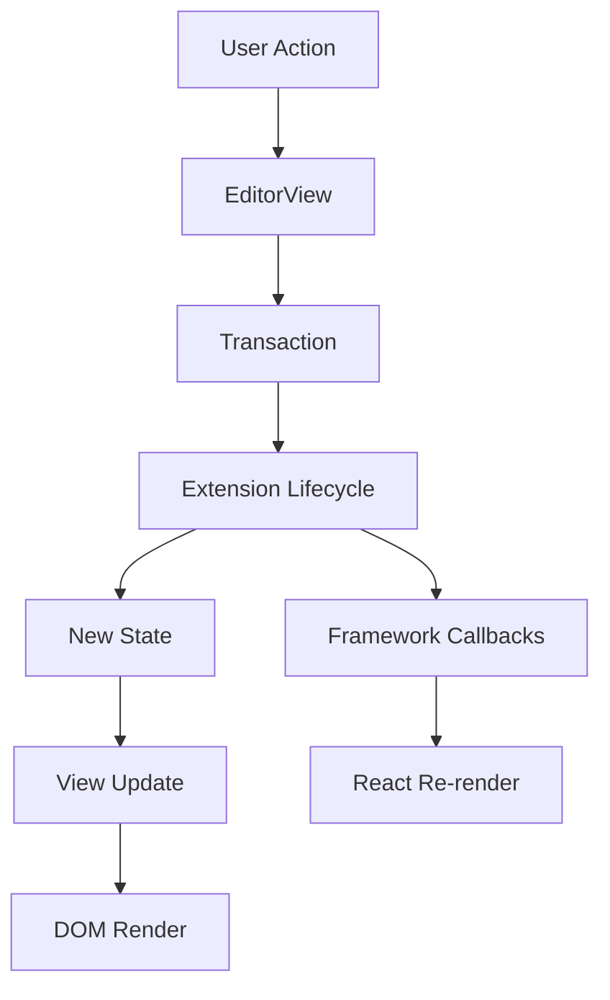

# Architecture

Remirror is built on a layered architecture that separates concerns and enables flexible, composable rich text editing. Understanding this architecture is essential for building and customizing editors effectively.

## Core Layers

Remirror's architecture consists of four primary layers that work together:

<Tabs>
  <Tab title="Foundation Layer">
    **ProseMirror Core**
    
    At the foundation, Remirror builds on ProseMirror's battle-tested primitives:
    - **Schema** - Defines the document structure (nodes and marks)
    - **State** - Immutable editor state management
    - **View** - DOM rendering and event handling
    - **Transactions** - State transformations
    
    Remirror wraps these primitives with a more accessible API while preserving their power.
  </Tab>
  
  <Tab title="Extension Layer">
    **Extension System**
    
    Extensions encapsulate all editor functionality:
    ```typescript
    import { PlainExtension, extension } from 'remirror';
    
    @extension({
      defaultPriority: ExtensionPriority.Default,
    })
    class MyExtension extends PlainExtension {
      get name() {
        return 'myExtension' as const;
      }
      
      // Lifecycle methods
      onCreate() { /* Called when manager is created */ }
      onView(view: EditorView) { /* Called when view is attached */ }
      onStateUpdate(props: StateUpdateLifecycleProps) { /* Called on state changes */ }
      onDestroy() { /* Cleanup */ }
    }
    ```
    
    Three extension types exist:
    - `NodeExtension` - Creates ProseMirror nodes (paragraphs, headings, etc.)
    - `MarkExtension` - Creates ProseMirror marks (bold, italic, links, etc.)
    - `PlainExtension` - Adds behavior without schema changes (keymaps, plugins, etc.)
  </Tab>
  
  <Tab title="Manager Layer">
    **RemirrorManager**
    
    The manager orchestrates extensions and manages the editor lifecycle:
    ```typescript
    import { RemirrorManager } from 'remirror';
    import { BoldExtension, ItalicExtension } from 'remirror/extensions';
    
    const manager = RemirrorManager.create([
      new BoldExtension(),
      new ItalicExtension(),
    ]);
    
    // Manager provides unified access to functionality
    manager.store.commands.toggleBold();
    manager.store.helpers.isSelectionEmpty();
    ```
    
    The manager:
    - Combines extensions and built-in presets
    - Creates the ProseMirror schema
    - Manages lifecycle events
    - Provides the extension store with commands and helpers
  </Tab>
  
  <Tab title="Framework Layer">
    **UI Framework Integration**
    
    Framework adapters connect Remirror to UI libraries:
    ```tsx
    import { useRemirror, Remirror } from '@remirror/react';
    
    function Editor() {
      const { manager, state } = useRemirror({
        extensions: () => [new BoldExtension()],
      });
      
      return (
        <Remirror manager={manager} initialContent={state}>
          <EditorComponent />
        </Remirror>
      );
    }
    ```
    
    Framework integration handles:
    - Component lifecycle synchronization
    - State management (controlled/uncontrolled)
    - Event handling and callbacks
    - Context provision for child components
  </Tab>
</Tabs>

## Data Flow

Understanding how data flows through Remirror is crucial:



<Accordion title="Detailed Flow Explanation">
  1. **User Action** - User types, clicks, or triggers a command
  2. **EditorView** - Captures the event and creates a transaction
  3. **Transaction** - Describes state changes to apply
  4. **Extension Lifecycle** - Extensions react via `onStateUpdate` hooks
  5. **New State** - Transaction creates new immutable state
  6. **View Update** - ProseMirror updates its view
  7. **DOM Render** - Changes reflected in the browser
  8. **Framework Callbacks** - React/framework notified of changes
  9. **React Re-render** - UI components update as needed
</Accordion>

## Extension Store

The extension store is the communication hub between extensions and the editor:

<Info>
  The store is available on every extension via `this.store` and contains all registered commands, helpers, and editor state.
</Info>

```typescript
class MyExtension extends PlainExtension {
  createCommands() {
    return {
      myCommand: () => ({ commands, state, tr }) => {
        // Access other extension commands
        commands.toggleBold();
        
        // Access helpers
        const isEmpty = this.store.helpers.isSelectionEmpty();
        
        // Access schema
        const schema = this.store.schema;
        
        return true; // Command succeeded
      },
    };
  }
}
```

### Store Contents

The store provides access to:

| Property | Available | Description |
|----------|-----------|-------------|
| `schema` | After `onCreate` | The ProseMirror schema |
| `view` | After `onView` | The ProseMirror EditorView |
| `commands` | After `onView` | All registered commands |
| `helpers` | After `onView` | All registered helpers |
| `chain` | After `onView` | Chained command builder |
| `manager` | Always | The RemirrorManager instance |
| `extensions` | Always | Array of all extensions |

<Tip>
  Extensions can't access `commands` and `helpers` in `onCreate` because they're still being constructed. Use `onView` for initialization that requires the full store.
</Tip>

## Built-in Extensions

Remirror includes essential built-in extensions that run automatically:

<Accordion title="Core Built-in Extensions">
  These extensions are part of the `builtinPreset` and provide fundamental functionality:
  
  - **TagsExtension** - Categorizes extensions by tag (block, mark, etc.)
  - **SchemaExtension** - Creates the ProseMirror schema
  - **AttributesExtension** - Manages extra attributes
  - **PluginsExtension** - Aggregates ProseMirror plugins
  - **CommandsExtension** - Collects and exposes commands
  - **HelpersExtension** - Collects and exposes helpers
  - **KeymapExtension** - Manages keyboard shortcuts
  - **InputRulesExtension** - Handles markdown-style input rules
  - **PasteRulesExtension** - Processes pasted content
  - **SuggestExtension** - Powers autocomplete functionality
  - **NodeViewsExtension** - Manages custom node renderers
  - **DecorationsExtension** - Handles editor decorations
  - **DocChangedExtension** - Tracks document changes
  - **UploadExtension** - Manages file uploads
  
  These run at `ExtensionPriority.Highest` to ensure they execute before user extensions.
</Accordion>

## Lifecycle Phases

The manager progresses through distinct phases:

```typescript
enum ManagerPhase {
  None = 0,        // Before manager creation
  Create = 1,      // During manager construction
  EditorView = 2,  // After view is attached
  Runtime = 3,     // Normal operation
  Destroy = 4,     // During cleanup
}
```

<Note>
  Each phase enables different functionality. Attempting to access `manager.store.view` before `EditorView` phase will throw an error.
</Note>

## Extension Priority

Extensions execute in priority order, with higher priority extensions running first:

```typescript
import { ExtensionPriority } from 'remirror';

const linkExtension = new LinkExtension({
  priority: ExtensionPriority.High, // Runs before default priority
});
```

Priority values:
- `Critical` (1,000,000) - Never use
- `Highest` (100,000) - Built-in extensions only
- `High` (10,000) - Important user extensions
- `Medium` (1,000) - Elevated priority
- `Default` (100) - Standard priority
- `Low` (10) - Defer to others
- `Lowest` (0) - Intentionally overridable

<Tip>
  Priority affects plugin order, keymap precedence, and mark wrapping in the schema. Use it to control which extension handles events first.
</Tip>

## Type Safety

Remirror leverages TypeScript's type system extensively:

```typescript
import { RemirrorManager } from 'remirror';
import { BoldExtension, ItalicExtension } from 'remirror/extensions';

const manager = RemirrorManager.create([
  new BoldExtension(),
  new ItalicExtension(),
]);

// TypeScript knows these commands exist
manager.store.commands.toggleBold(); // ✅
manager.store.commands.toggleItalic(); // ✅
manager.store.commands.toggleStrike(); // ❌ Type error
```

The type system:
- Infers available commands from extensions
- Provides autocomplete for all extension APIs
- Catches errors at compile time
- Enables safe refactoring

## Next Steps

<CardGroup cols={2}>
  <Card title="Extensions" icon="puzzle-piece" href="./extensions">
    Learn how to create and configure extensions
  </Card>
  <Card title="Manager" icon="gear" href="./manager">
    Deep dive into the RemirrorManager lifecycle
  </Card>
  <Card title="Presets" icon="layer-group" href="./presets">
    Compose extensions into reusable presets
  </Card>
  <Card title="State Management" icon="database" href="./state-management">
    Understand state flow and updates
  </Card>
</CardGroup>