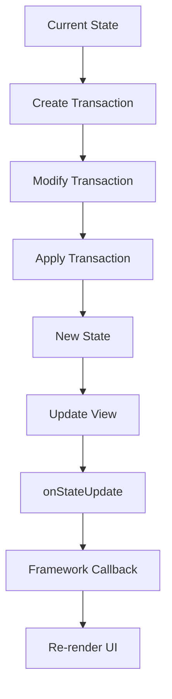

# State Management

State management in Remirror is built on ProseMirror's immutable state model. Understanding how state flows through the editor is essential for building robust applications.

<Info>
  Remirror inherits ProseMirror's transactional state model where every change creates a new immutable state object. This makes state changes predictable, debuggable, and perfect for React-style architectures.
</Info>

## Core Concepts

### EditorState

The `EditorState` represents the complete state of the editor at a point in time:

```typescript
import { EditorState } from '@remirror/pm/state';

interface EditorState {
  doc: ProsemirrorNode;     // The document
  selection: Selection;      // Current selection
  storedMarks: Mark[] | null; // Marks for next insert
  schema: EditorSchema;      // The schema
  plugins: Plugin[];         // Active plugins
  tr: Transaction;           // Create a transaction
}
```

<Note>
  EditorState is **immutable**. You never modify it directly—you create transactions that produce new states.
</Note>

### Transactions

Transactions describe changes to apply to the state:

```typescript
import { Transaction } from '@remirror/pm/state';

// Get current state
const state = manager.store.view.state;

// Create a transaction
const tr = state.tr;

// Describe changes
tr.insertText('Hello', 0);
tr.addMark(0, 5, state.schema.marks.bold.create());
tr.setSelection(TextSelection.create(tr.doc, 5));

// Apply transaction to create new state
const newState = state.apply(tr);

// Update the view
manager.store.view.updateState(newState);
```

Key transaction properties:

| Property | Description |
|----------|-------------|
| `tr.doc` | The document after pending changes |
| `tr.selection` | The selection after pending changes |
| `tr.docChanged` | Whether the document changed |
| `tr.selectionSet` | Whether selection was explicitly set |
| `tr.storedMarks` | Marks to apply to next insert |
| `tr.steps` | List of transformation steps |

<Tip>
  Build up transactions by chaining methods: `tr.insertText('Hi').setSelection(...)`. This is more efficient than creating multiple transactions.
</Tip>

## State Flow

Understanding the state update cycle:



### Step-by-Step Flow

1. **Current State** - The editor starts with a state
2. **Create Transaction** - An action creates a transaction from current state
3. **Modify Transaction** - Add steps (insertions, deletions, marks, etc.)
4. **Apply Transaction** - Generate new state from transaction
5. **Update View** - ProseMirror updates its view
6. **onStateUpdate** - Extensions react to the change
7. **Framework Callback** - React/framework is notified
8. **Re-render UI** - UI components update

## Controlled vs Uncontrolled

Remirror supports both controlled and uncontrolled state management:

<Tabs>
  <Tab title="Uncontrolled">
    **Uncontrolled** - Remirror manages state internally.
    
    ```tsx
    import { useRemirror, Remirror } from '@remirror/react';
    
    function Editor() {
      const { manager, state } = useRemirror({
        extensions: () => [new BoldExtension()],
        content: '<p>Initial content</p>',
        stringHandler: 'html',
      });
      
      // State managed internally by Remirror
      return <Remirror manager={manager} initialContent={state} />;
    }
    ```
    
    Characteristics:
    - Simpler to use
    - Better performance
    - State lives in ProseMirror
    - Use `onChange` to react to changes
    
    <Tip>
      Use uncontrolled mode unless you need fine-grained control over state.
    </Tip>
  </Tab>
  
  <Tab title="Controlled">
    **Controlled** - Your app manages state externally.
    
    ```tsx
    import { useState } from 'react';
    import { useRemirror, Remirror } from '@remirror/react';
    import { EditorState } from 'remirror';
    
    function Editor() {
      const { manager } = useRemirror({
        extensions: () => [new BoldExtension()],
      });
      
      const [state, setState] = useState<EditorState>(() =>
        manager.createState({
          content: '<p>Initial</p>',
          stringHandler: 'html',
        })
      );
      
      return (
        <Remirror
          manager={manager}
          state={state}
          onChange={(parameter) => {
            // Update external state
            setState(parameter.state);
          }}
        />
      );
    }
    ```
    
    Characteristics:
    - Full control over state
    - Can implement undo/redo externally
    - Can sync state across components
    - Slightly more overhead
    
    Use cases:
    - Multi-editor synchronization
    - Custom persistence logic
    - Time-travel debugging
    - External undo/redo
  </Tab>
</Tabs>

## Reacting to State Changes

Multiple ways to respond to state updates:

### Extension Lifecycle

React to changes within extensions:

```typescript
import { StateUpdateLifecycleProps } from 'remirror';

class AutoSaveExtension extends PlainExtension {
  private saveTimer?: NodeJS.Timeout;
  
  onStateUpdate(props: StateUpdateLifecycleProps) {
    const { state, previousState, tr } = props;
    
    // Only react to document changes
    if (!tr?.docChanged) {
      return;
    }
    
    // Debounced save
    clearTimeout(this.saveTimer);
    this.saveTimer = setTimeout(() => {
      this.saveDocument(state);
    }, 1000);
  }
  
  private saveDocument(state: EditorState) {
    const content = this.store.helpers.getHTML(state);
    localStorage.setItem('document', content);
  }
  
  onDestroy() {
    clearTimeout(this.saveTimer);
  }
}
```

<Info>
  `onStateUpdate` receives three key properties: `state` (new state), `previousState` (old state), and `tr` (the transaction that caused the change, or undefined for external updates).
</Info>

### onChange Callback

React to changes in your component:

```tsx
import { useCallback } from 'react';
import { Remirror } from '@remirror/react';
import { RemirrorEventListenerProps } from 'remirror';

function Editor({ manager, state }) {
  const handleChange = useCallback(
    (parameter: RemirrorEventListenerProps) => {
      const { state, tr } = parameter;
      
      // Document changed
      if (tr?.docChanged) {
        console.log('Document updated');
        
        // Get content
        const html = parameter.helpers.getHTML();
        const json = state.doc.toJSON();
        
        // Save or process
        saveToBackend(html);
      }
      
      // Selection changed
      if (!tr || (tr && !state.selection.eq(parameter.previousState.selection))) {
        console.log('Selection changed');
      }
    },
    []
  );
  
  return (
    <Remirror
      manager={manager}
      initialContent={state}
      onChange={handleChange}
    />
  );
}
```

### useEditorEvent Hook

Subscribe to specific events:

```tsx
import { useEditorEvent } from '@remirror/react';

function EditorToolbar() {
  useEditorEvent('focus', () => {
    console.log('Editor focused');
  });
  
  useEditorEvent('blur', () => {
    console.log('Editor blurred');
  });
  
  return <div>Toolbar</div>;
}
```

### Manager Event Listeners

Subscribe directly to manager:

```typescript
const unsubscribe = manager.addListener('stateUpdate', ({ state, tr }) => {
  if (tr?.docChanged) {
    console.log('Document changed');
  }
});

// Clean up
unsubscribe();
```

## Commands and State

Commands are functions that receive state and return transactions:

### Anatomy of a Command

```typescript
import { CommandFunction } from 'remirror';

const myCommand: CommandFunction = (props) => {
  const { state, dispatch, view, tr } = props;
  
  // Check if command can run
  if (!canRunCommand(state)) {
    return false;
  }
  
  // Modify transaction
  tr.insertText('Hello');
  
  // Dispatch if not a "dry run"
  dispatch?.(tr);
  
  // Return true if command succeeded
  return true;
};
```

Command function receives:

| Property | Type | Description |
|----------|------|-------------|
| `state` | `EditorState` | Current state |
| `dispatch` | `DispatchFunction?` | Dispatch transaction (undefined for dry run) |
| `view` | `EditorView` | The editor view |
| `tr` | `Transaction` | Pre-created transaction to modify |

<Note>
  When `dispatch` is undefined, the command is in "dry run" mode (checking if it can execute). Don't perform side effects in this case.
</Note>

### Creating Commands

```typescript
class InsertDateExtension extends PlainExtension {
  createCommands() {
    return {
      insertDate: (): CommandFunction => {
        return ({ tr, dispatch }) => {
          const date = new Date().toLocaleDateString();
          dispatch?.(tr.insertText(date));
          return true;
        };
      },
      
      insertTime: (): CommandFunction => {
        return ({ tr, dispatch, state }) => {
          // Check if we can insert
          if (!state.selection.empty) {
            return false;
          }
          
          const time = new Date().toLocaleTimeString();
          dispatch?.(tr.insertText(time));
          return true;
        };
      },
    };
  }
}

// Usage
manager.store.commands.insertDate();

// Check if enabled
if (manager.store.commands.insertTime.enabled()) {
  manager.store.commands.insertTime();
}
```

## State Inspection

Query and analyze editor state:

### Document Structure

```typescript
const state = manager.store.view.state;

// Document properties
console.log(state.doc.nodeSize);      // Total size
console.log(state.doc.childCount);    // Number of children
console.log(state.doc.textContent);   // Plain text content

// Iterate nodes
state.doc.descendants((node, pos) => {
  console.log(`${node.type.name} at position ${pos}`);
  return true; // Continue iteration
});

// Get node at position
const node = state.doc.nodeAt(10);
if (node) {
  console.log(node.type.name);
  console.log(node.attrs);
  console.log(node.textContent);
}
```

### Selection

```typescript
const { selection } = state;

// Selection properties
console.log(selection.empty);         // Is collapsed?
console.log(selection.from);          // Start position
console.log(selection.to);            // End position
console.log(selection.$from);         // Resolved start
console.log(selection.$to);           // Resolved end

// Text selection
if (selection instanceof TextSelection) {
  console.log(selection.$cursor);     // Cursor position if collapsed
}

// Node selection
if (selection instanceof NodeSelection) {
  console.log(selection.node);        // Selected node
}
```

### Active Marks

```typescript
// Get active marks at selection
const { $from } = state.selection;
const marks = $from.marks();

// Check for specific mark
const boldMark = state.schema.marks.bold;
const hasBold = marks.some((mark) => mark.type === boldMark);

// Get stored marks (for next insert)
const storedMarks = state.storedMarks;
```

## Performance Optimization

<AccordionGroup>
  <Accordion title="Memoize Helpers">
    Cache expensive computations:
    
    ```typescript
    class WordCountExtension extends PlainExtension {
      private cachedCount?: { doc: ProsemirrorNode; count: number };
      
      createHelpers() {
        return {
          getWordCount: () => {
            const { doc } = this.store.view.state;
            
            // Return cached if doc unchanged
            if (this.cachedCount?.doc === doc) {
              return this.cachedCount.count;
            }
            
            // Compute and cache
            const count = this.countWords(doc);
            this.cachedCount = { doc, count };
            return count;
          },
        };
      }
    }
    ```
  </Accordion>
  
  <Accordion title="Batch Updates">
    Combine multiple changes into one transaction:
    
    ```typescript
    // ❌ Multiple transactions (slower)
    manager.store.commands.insertText('Hello');
    manager.store.commands.toggleBold();
    manager.store.commands.focus('end');
    
    // ✅ Single chained transaction (faster)
    manager.store.chain
      .insertText('Hello')
      .toggleBold()
      .focus('end')
      .run();
    ```
  </Accordion>
  
  <Accordion title="Debounce State Updates">
    Limit expensive reactions:
    
    ```typescript
    import { debounce } from 'lodash-es';
    
    class SaveExtension extends PlainExtension {
      private debouncedSave = debounce(this.save, 1000);
      
      onStateUpdate({ tr }) {
        if (tr?.docChanged) {
          this.debouncedSave();
        }
      }
      
      private save() {
        const html = this.store.helpers.getHTML();
        saveToDB(html);
      }
    }
    ```
  </Accordion>
  
  <Accordion title="Avoid Heavy onStateUpdate">
    Keep state update handlers lightweight:
    
    ```typescript
    // ❌ Heavy computation on every update
    onStateUpdate({ state }) {
      const wordCount = this.computeComplexMetrics(state.doc);
      this.updateUI(wordCount);
    }
    
    // ✅ Defer heavy work
    onStateUpdate({ tr }) {
      if (tr?.docChanged) {
        requestIdleCallback(() => {
          this.updateMetrics();
        });
      }
    }
    ```
  </Accordion>
</AccordionGroup>

## Common Patterns

### Tracking Changes

```typescript
class ChangeTrackerExtension extends PlainExtension {
  private changeCount = 0;
  
  onStateUpdate({ tr }) {
    if (tr?.docChanged) {
      this.changeCount++;
    }
  }
  
  createHelpers() {
    return {
      getChangeCount: () => this.changeCount,
    };
  }
}
```

### Syncing External State

```tsx
import { useEffect, useState } from 'react';
import { useRemirrorContext } from '@remirror/react';

function WordCounter() {
  const { helpers } = useRemirrorContext();
  const [count, setCount] = useState(0);
  
  useEditorEvent('stateUpdate', ({ tr }) => {
    if (tr?.docChanged) {
      setCount(helpers.getWordCount());
    }
  });
  
  return <div>Words: {count}</div>;
}
```

### Custom State Plugin

```typescript
import { Plugin, PluginKey } from '@remirror/pm/state';

interface PluginState {
  lastModified: number;
}

const pluginKey = new PluginKey<PluginState>('timestamp');

const timestampPlugin = new Plugin<PluginState>({
  key: pluginKey,
  
  state: {
    init: () => ({ lastModified: Date.now() }),
    
    apply: (tr, value) => {
      if (tr.docChanged) {
        return { lastModified: Date.now() };
      }
      return value;
    },
  },
});

// Access plugin state
const pluginState = pluginKey.getState(state);
console.log(pluginState?.lastModified);
```

## Next Steps

<CardGroup cols={2}>
  <Card title="Extensions" icon="puzzle-piece" href="./extensions">
    Learn about extension lifecycle
  </Card>
  <Card title="Manager" icon="gear" href="./manager">
    Understand manager orchestration
  </Card>
  <Card title="Architecture" icon="sitemap" href="./architecture">
    Explore overall architecture
  </Card>
  <Card title="React Integration" icon="react" href="/integrations/react">
    React-specific state patterns
  </Card>
</CardGroup>